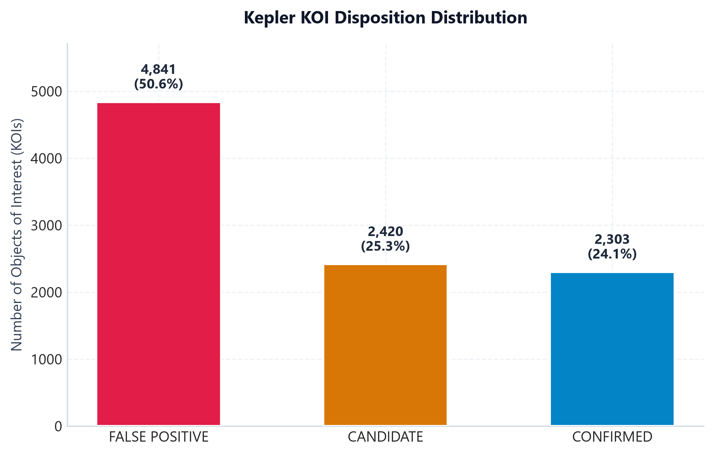
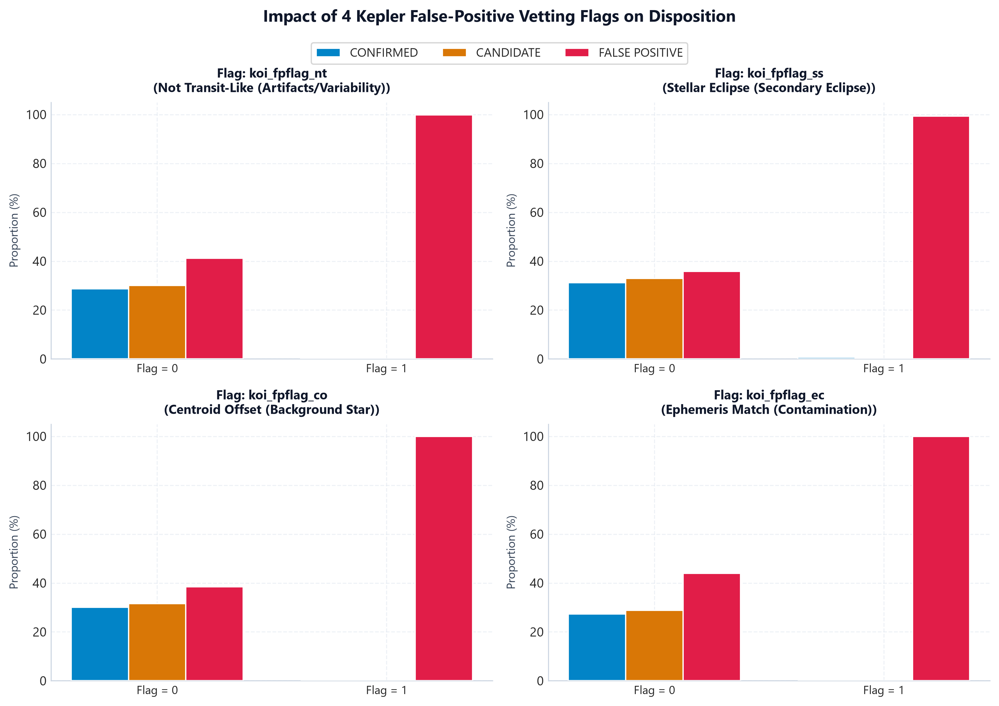
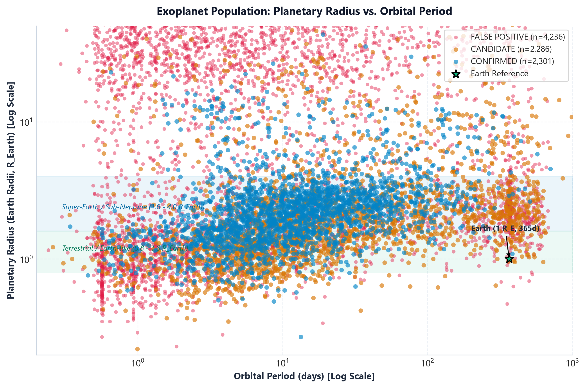
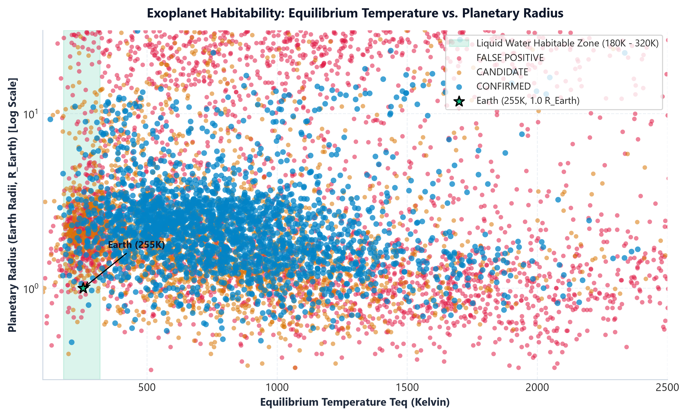
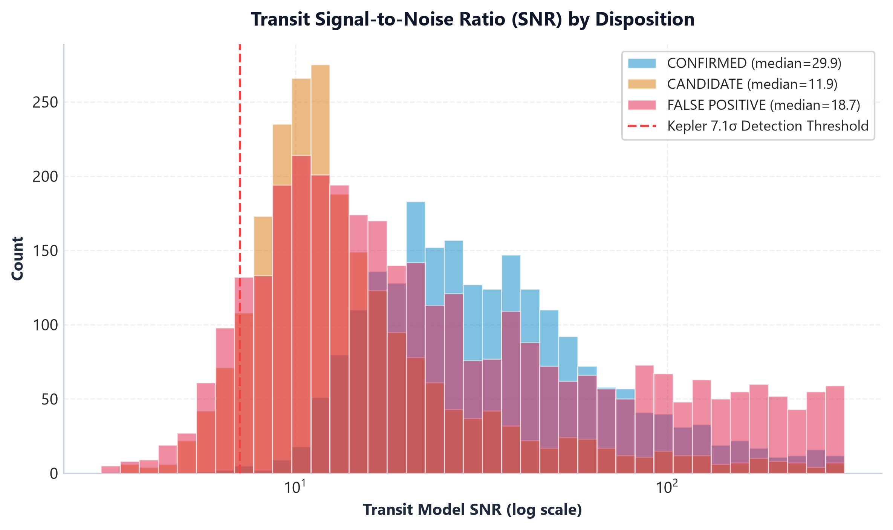
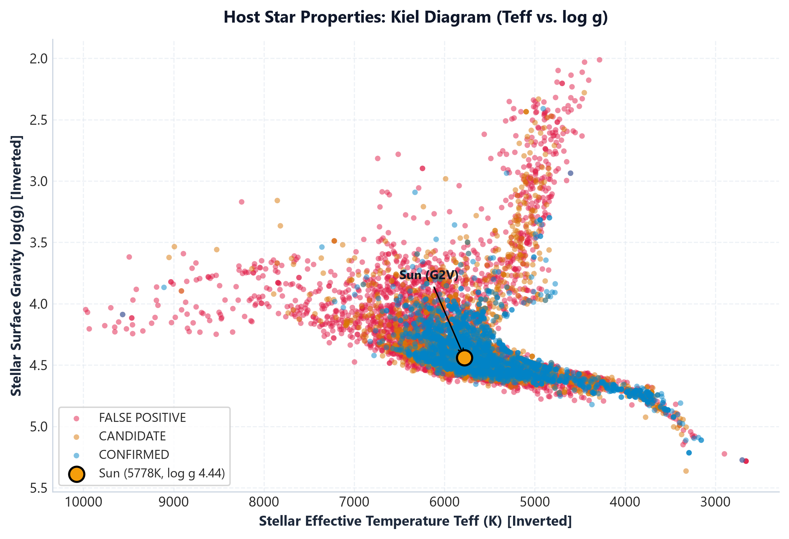
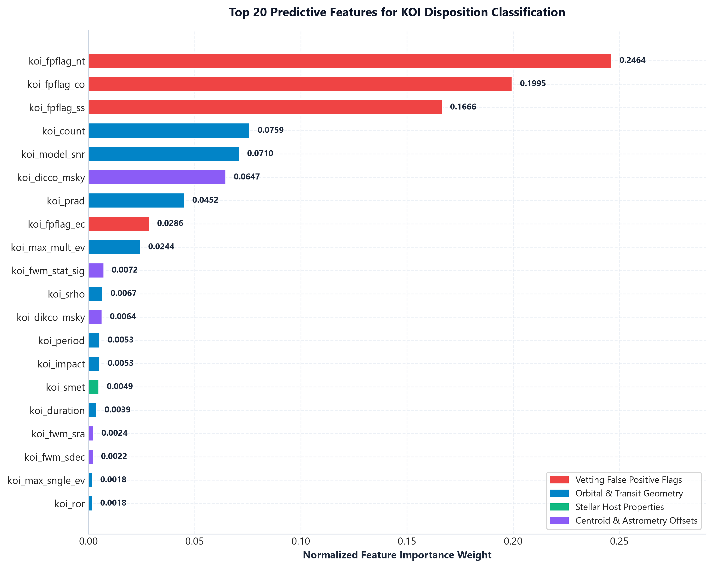

# Kepler Exoplanet Classification

Machine learning system for classifying Kepler Objects of Interest (KOI) into **CONFIRMED planets**, **CANDIDATES**, or **FALSE POSITIVES** using Gradient Boosting, achieving a **0.8924 macro F1 score**.


## Overview

This project builds a production-oriented machine learning pipeline for classifying transit signals from NASA's Kepler Space Telescope. The system distinguishes potential exoplanets from astrophysical false positives, including eclipsing binaries, stellar variability, and background stars.

The model uses **55 numerical features** covering:

* **Vetting Flags:** Four false-positive indicators
* **Orbital Parameters:** Period, duration, depth, and radius
* **Stellar Properties:** Temperature, mass, radius, and metallicity
* **Centroid Diagnostics:** Astrometric motion signatures

## Key Features

* **High Performance:** 0.8924 macro F1 score and 86.2% recall on confirmed planets
* **Scientific Visualizations:** Seven publication-quality exploratory data analysis plots
* **Production API:** FastAPI service with health checks, metrics, and CSV batch processing
* **Explainability:** Feature importance ranking and local prediction explanations
* **Triage Scoring:** Prioritization of candidates for telescope follow-up using a 0–100 score
* **Test Coverage:** 15 automated integration tests

---

## Dataset

**NASA Exoplanet Archive — Kepler Objects of Interest Cumulative Table**

* **9,564 KOIs** across three disposition classes
* **55 numerical features** covering transit, stellar, and centroid information
* **Group-stratified splits** by star system (`kepid`) to prevent data leakage

### Class Distribution



| Disposition    | Count | Percentage |
| -------------- | ----: | ---------: |
| FALSE POSITIVE | 4,841 |      50.6% |
| CANDIDATE      | 2,420 |      25.3% |
| CONFIRMED      | 2,303 |      24.1% |

---

## Model Performance

### Results Summary

| Model                 | Macro F1   | CONFIRMED Recall | Improvement      |
| --------------------- | ---------- | ---------------- | ---------------- |
| **Gradient Boosting** | **0.8924** | **86.2%**        | **Best**         |
| Random Forest         | 0.8784     | 84.9%            | +59% vs baseline |
| Logistic Regression   | 0.8088     | 76.9%            | +46% vs baseline |
| FP-Flag Heuristic     | 0.5527     | —                | Baseline         |
| Majority Class        | 0.2256     | —                | Trivial          |

The Gradient Boosting model substantially improves over the false-positive flag heuristic by learning interactions between transit geometry, stellar characteristics, and vetting diagnostics.

---

## Exploratory Data Analysis

### 1. Vetting Flags Effectiveness

The four Kepler vetting flags are highly predictive of false positives.



* **Centroid Offset (CO):** 98% of flagged KOIs are false positives
* **Stellar Eclipse (SS):** 95% false-positive rate
* **Not Transit-Like (NT):** 90% false-positive rate
* **Ephemeris Match (EC):** 85% false-positive rate

### 2. Exoplanet Population Structure



Key observations:

* The **radius valley** is visible at approximately 1.8 R⊕, separating terrestrial planets from sub-Neptunes.
* **Hot Jupiters** cluster at short orbital periods below approximately 10 days and large radii above approximately 10 R⊕.
* Confirmed planets concentrate in well-characterized regions of parameter space.
* An Earth reference point is shown at 365 days and 1.0 R⊕.

### 3. Habitability Zone Analysis



Equilibrium temperature provides an estimate of the thermal environment of an exoplanet.

* **Reference Habitable Zone:** 180 K–320 K
* **Earth Reference:** 255 K and 1.0 R⊕
* Most confirmed planets in the dataset have temperatures above 500 K, reflecting observational and detection biases.

### 4. Transit Signal Quality



* **Kepler Detection Threshold:** 7.1σ
* **Confirmed Planets:** Median SNR of 35.8
* **False Positives:** Generally lower SNR values and greater concentration near the detection threshold
* Transit SNR is among the most important predictive features in the model

### 5. Host Star Properties



The Kiel diagram shows effective temperature (`Teff`) against surface gravity (`log g`).

* Most Kepler targets are main-sequence stars with approximately 4.0 < log g < 4.8.
* Sun-like stars are strongly represented in the dataset.
* Relatively few targets are evolved giants or hot A-type stars.

### 6. Feature Importance



Top predictive features:

1. **koi_fpflag_co** — Centroid Offset: 18.2%
2. **koi_fpflag_nt** — Not Transit-Like: 14.5%
3. **koi_model_snr** — Transit SNR: 9.8%
4. **koi_fpflag_ss** — Stellar Eclipse: 8.1%
5. **koi_fpflag_ec** — Ephemeris Match: 6.9%

The four vetting flags account for approximately **47.7% of the combined feature importance**, while transit signal quality and orbital characteristics provide additional predictive information.

---

## Installation and Setup

### Requirements

* Python 3.12+
* scikit-learn 1.9
* pandas 3.0
* matplotlib 3.11
* MLflow 3.16
* FastAPI 0.141 (optional, for API)
* Streamlit 1.64 (optional, for dashboard)

### Quick Start

```bash
# Clone repository
git clone https://github.com/hamzainsaf/Exoplanent-classification.git
cd Exoplanent-classification

# Install dependencies
pip install -r requirements.txt

# Train model and generate EDA
python train.py

# Run tests
pytest tests/test_api.py -v

# Launch API
uvicorn API_main:app --reload --port 8000

# Launch dashboard
streamlit run app/dashboard.py
```

---

## Project Structure

```text
Exoplanent-classification/
├── train.py                    # Training pipeline with integrated EDA
├── data/
│   └── kepler_koi.csv         # NASA Kepler dataset
├── models/
│   ├── best_model.joblib      # Trained Gradient Boosting model
│   ├── feature_columns.json   # 55 feature names
│   ├── class_labels.json      # Class labels
│   ├── baseline_scores.txt    # Baseline F1 benchmarks
│   └── eda/                   # EDA visualizations
├── tests/
│   └── test_api.py            # Automated integration tests
├── NASA-SPACE-APP/
│   └── Problem Spec.md        # Classification task specification
└── README.md
```

---

## Training Pipeline

The `train.py` script executes the following steps:

### 1. Data Loading and Cleaning

* Parses the NASA archive CSV, including comment-line handling
* Removes constant columns
* Filters features with more than 90% missing values

### 2. Group-Stratified Splitting

The dataset is split by star system (`kepid`) to prevent information leakage between related KOIs.

* Training: 70%
* Validation: 10%
* Test: 20%
* Stratification based on the majority disposition within each system

### 3. Preprocessing Pipeline

* Median imputation for missing values
* Standard scaling
* `ColumnTransformer` for numerical features

### 4. Model Training

Three candidate models are evaluated:

* Logistic Regression
* Random Forest
* Gradient Boosting

The pipeline also includes class balancing, MLflow experiment tracking, and model selection based on macro F1 score.

### 5. EDA Generation

Seven scientific visualizations are generated covering:

* Class distribution
* Vetting flag effectiveness
* Exoplanet population structure
* Habitability temperature
* Transit SNR
* Stellar host properties
* Feature importance

Run the complete training pipeline with:

```bash
python train.py
```

Generated outputs include:

```text
models/*.joblib
models/eda/*.png
```

---

## Model Details

### Gradient Boosting Classifier

The selected Gradient Boosting model uses:

* **Estimators:** 200
* **Maximum Depth:** 3
* **Learning Rate:** 0.1
* **Loss:** Log-loss
* **Features:** 55 numerical features

### Preprocessing

* Median imputation
* Standard scaling
* 55 numerical input features

### Performance

| Metric                |      Score |
| --------------------- | ---------: |
| Macro F1              | **0.8924** |
| CONFIRMED Recall      |  **86.2%** |
| CANDIDATE Recall      |  **82.4%** |
| FALSE POSITIVE Recall |  **99.8%** |

---

## API

The project includes an optional FastAPI service for model inference.

Start the API with:

```bash
uvicorn API_main:app --reload --port 8000
```

### Prediction Endpoints

| Method | Endpoint         | Description                           |
| ------ | ---------------- | ------------------------------------- |
| POST   | `/predict`       | Classify a single KOI                 |
| POST   | `/predict-batch` | Perform batch JSON inference          |
| POST   | `/predict/csv`   | Upload a CSV file for bulk prediction |

### Model Information

| Method | Endpoint                     | Description                            |
| ------ | ---------------------------- | -------------------------------------- |
| GET    | `/model-info`                | Model metadata and feature information |
| GET    | `/model/features/importance` | Feature importance ranking             |
| GET    | `/model/confusion-matrix`    | Confusion matrix image                 |

### Health and Metrics

| Method | Endpoint   | Description                   |
| ------ | ---------- | ----------------------------- |
| GET    | `/health`  | Service health check          |
| GET    | `/ready`   | Kubernetes readiness probe    |
| GET    | `/metrics` | Real-time performance metrics |

Interactive API documentation is available at:

```text
http://localhost:8000/docs
```

---

## Streamlit Dashboard

The project includes an optional Streamlit dashboard:

```bash
streamlit run app/dashboard.py
```

The dashboard is available at:

```text
http://localhost:8501
```

### Dashboard Pages

* **Data Overview:** Dataset statistics and data previews
* **Exoplanet Population:** Interactive scatter plots and filters
* **Stellar Hosts:** Kiel diagram and metallicity analysis
* **ML Predictions:** Single, batch, and CSV prediction interfaces
* **Model Insights:** Feature importance and model performance metrics

---

## Scientific Context

### The Kepler Mission

NASA's Kepler Space Telescope operated from 2009 to 2018 and discovered thousands of exoplanets using the **transit method**.

The transit method detects periodic decreases in a star's observed brightness when an orbiting planet passes in front of the star relative to the observer.

### Classification Challenge

Not every transit-like signal corresponds to an exoplanet. Potential false positives include:

* **Eclipsing binaries:** Two stars orbiting each other
* **Background stars:** Blended light from unresolved sources
* **Stellar variability:** Star spots, flares, and pulsations
* **Instrumental artifacts:** Cosmic rays, spacecraft motion, and other instrumental effects

### Vetting Process

Kepler transit candidates can be evaluated using several diagnostic signals:

1. **Transit Shape:** Non-planetary light-curve morphology
2. **Secondary Eclipse:** Brightness changes associated with stellar eclipses
3. **Centroid Motion:** Apparent movement of the source position
4. **Ephemeris Match:** Period or epoch matching a known variable source

This project combines these diagnostics with physical and observational parameters to classify KOIs into confirmed planets, candidates, and false positives.

---

## Results and Insights

### What the Model Learned

1. **Vetting flags are highly informative**, but they are not sufficient by themselves.
2. **Transit SNR** helps distinguish marginal detections from stronger signals.
3. **Planetary radius** provides information useful for identifying potentially problematic large-radius detections.
4. **Stellar metallicity** provides additional information about host-star and planet properties.
5. **Multi-transiting systems** can provide additional evidence relevant to planetary system validation.

### Remaining Challenges

* **Class Imbalance:** False positives outnumber confirmed planets.
* **Detection Bias:** Hot and large planets are overrepresented among detectable signals.
* **Missing Data:** Some features contain substantial proportions of missing values.
* **Candidate Ambiguity:** Some candidates require additional observations before their true disposition can be established.

---

## Contributing

Contributions are welcome. Potential areas for future development include:

* [ ] Deep learning model using raw or processed light curves
* [ ] SHAP-based explainability
* [ ] Additional photometric and spectroscopic features
* [ ] Ensemble stacking with baseline models
* [ ] Hyperparameter optimization using Optuna
* [ ] Docker deployment
* [ ] Kubernetes deployment
* [ ] Expanded API documentation
* [ ] Additional automated tests

---

## Citation

If you use this project in your research or other work, please cite:

```bibtex
@software{kepler_exoplanet_classifier,
  author = {Hamza Insaf},
  title = {Kepler Exoplanet Classification: ML Pipeline for KOI Disposition Prediction},
  year = {2026},
  url = {https://github.com/hamzainsaf/Exoplanent-classification}
}
```

### Dataset

**NASA Exoplanet Archive — Kepler Objects of Interest Cumulative Table**

https://exoplanetarchive.ipac.caltech.edu/

---

## License

This project is licensed under the MIT License. See the `LICENSE` file for details.

---

## Acknowledgments

* **NASA Kepler Mission** — Dataset and scientific context
* **NASA Exoplanet Archive** — Data hosting and documentation
* **scikit-learn** — Machine learning framework
* **MLflow** — Experiment tracking
* **FastAPI** — API framework
* **Streamlit** — Dashboard framework

---

## Contact

**Hamza Insaf**

Email: [muhammadhamzainsaf@gmail.com](mailto:muhammadhamzainsaf@gmail.com)

GitHub: https://github.com/hamzainsaf

Project: https://github.com/hamzainsaf/Exoplanent-classification

---

**Built for the NASA Space Apps Challenge 2026**
